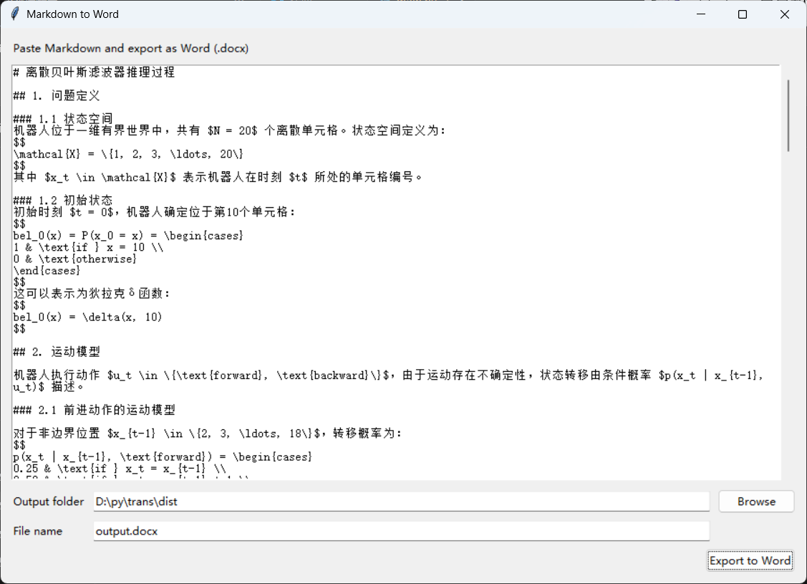

# Md2Word

一个简单的 Markdown 转 Word 小工具（Windows GUI）。

## 功能

- 粘贴 Markdown 文本
- 选择输出文件夹
- 输入输出文件名
- 一键导出 `.docx` 文件

## 运行方式（源码）

1. 安装依赖

```bash
pip install -r requirements.txt
```

2. 启动程序

```bash
python main.py
```

## 运行方式（发行版）

- 直接双击 `dist/Md2Word.exe` 即可使用。

界面：


运行结果：
